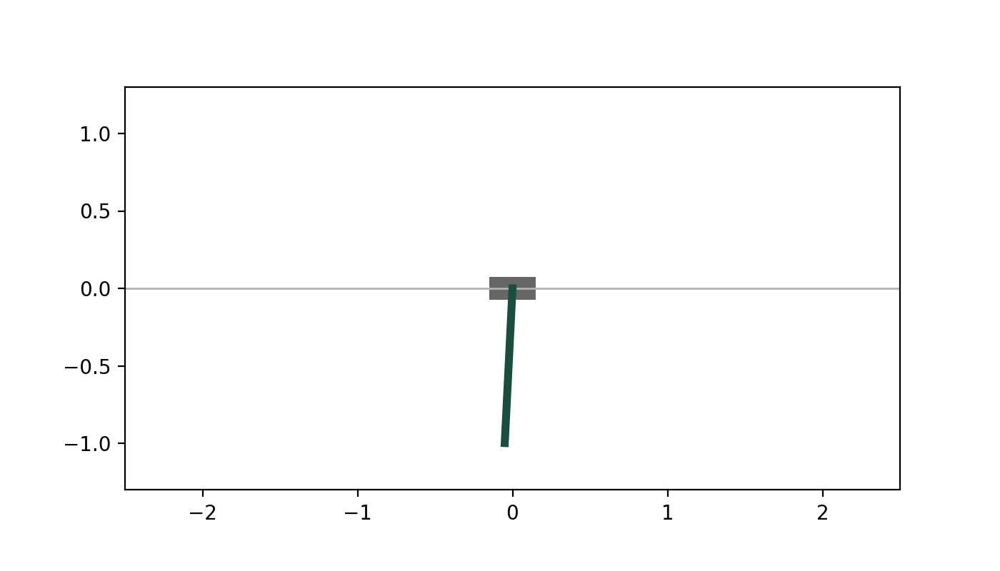
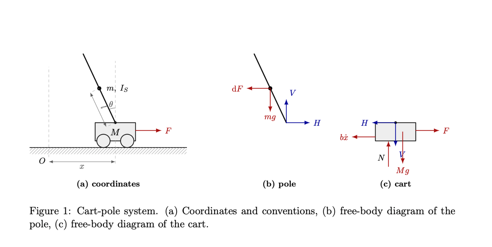
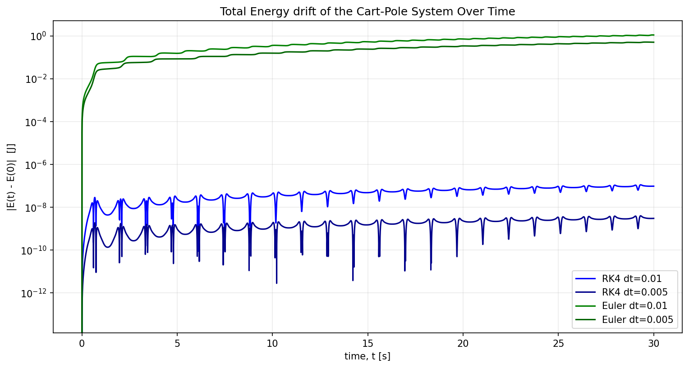
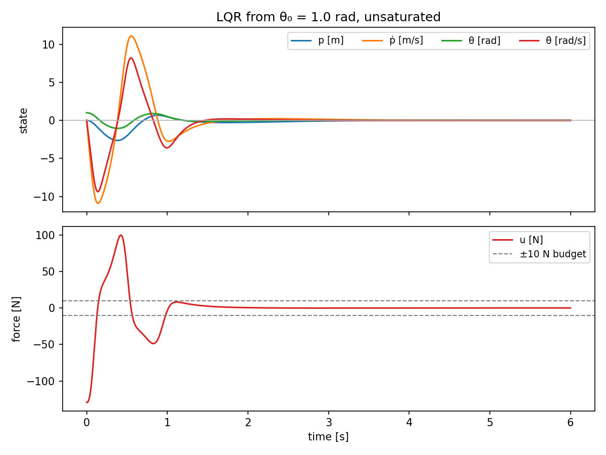
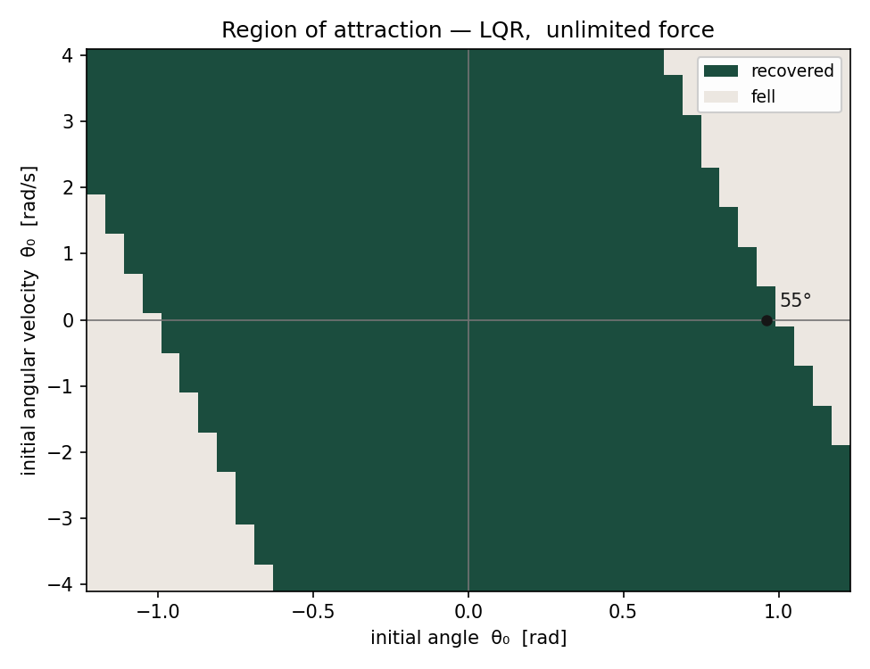
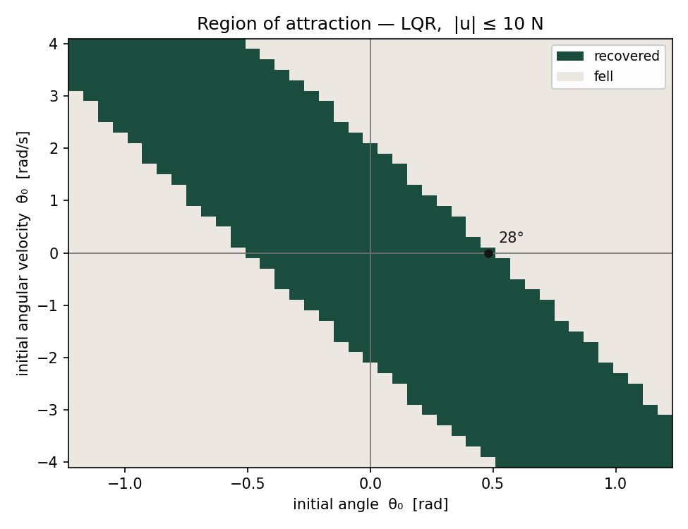
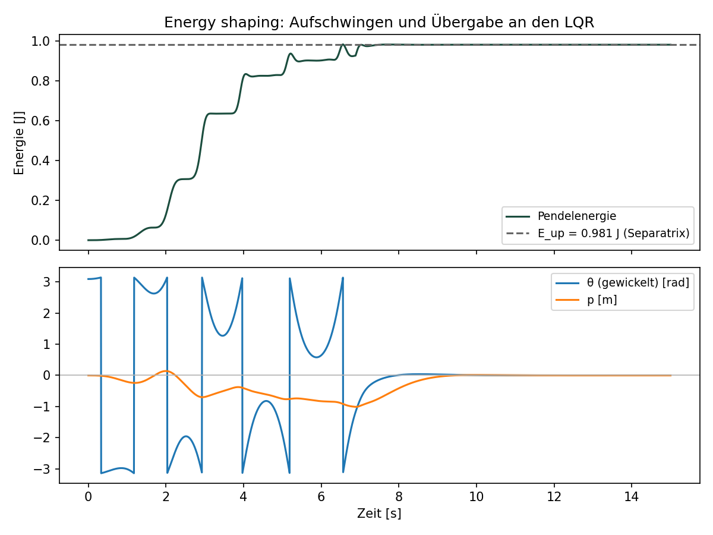

## Intro

In this project I built a cart-pole, based on a pole, jointed to a cart that has freedom of movement in one dimension. The goal was to bring the pole in an upright position from any starting position by using the cart's ability to accelerate in one dimension. I achieved this by deriving the equations of motion by hand first from free-body diagrams and then using those to first swing the pole up (if necessary) and then stabilizing it using a linear quadratic regulator (LQR). 

## Results

| Quantity | Value | What it means |
|---|---|---|
| Open-loop eigenvalues | `0, 0, +3.974, −3.974` | Unstable, the tilt doubles every **0.174 s**. The two zeros are the cart drifting. |
| Closed-loop eigenvalues | `−15.24, −5.97, −1.41 ± 1.08j` | All in the left half-plane. Settling **2.84 s**, damping ratio **ζ = 0.79**. |
| LQR gain | `K = [−20.00, −22.55, 129.38, 31.46]` | From Bryson's rule and the Riccati equation, not tuned by hand. |
| Hand-derived vs. numerical Jacobian | max \|ΔA\| = **4·10⁻¹²**, max \|ΔB\| = **2·10⁻¹⁶** | Two independent routes to the same 16 numbers. |
| RK4 vs. explicit Euler, 30 s | **≈ 11 million ×** more accurate at equal step size | Euler more than *doubles* the system's total energy. |
| Region of attraction, \|u\| ≤ 10 N | **27.5°** | The realistic limit. |
| Region of attraction, unlimited force | **55°** | Demands **129 N** and **2.6 m** of track. The unrealistic limit. |
| Swing-up, time to upright | **8.63s** | Mostly pumping energy over several swings. |
| Swing-up, cart travel / peak force | **1.01 m / 8.63 N** | Never saturates limit fully, as the force stays below 10 N. |
| Swing-up, before handoff to LQR | **6.89 s** | The force limit of 10 N prevents instant energy transfer. Instead, energy builds gradually across successive swings. |

## 1. Deriving the equations

I derived the equations of motion by hand from the following free-body diagrams of the cart and the pole, using Newton–Euler (linear momentum balance at the centre of mass, plus angular momentum balance about that same point). Note that the figure writes the cart coordinate as x and the applied force as F, the code and the equations use p and u. The disruptive Force dF is ignored as of now in this project. Throughout, θ is measured from the upright position, so the important equilibrium sits at the origin of the state space, and `l` is the distance from the pivot to the pole's centre of mass which is half the rod length.

Eliminating the pivot reactions $H$ and $V$ between the five scalar equations leaves two coupled equations of motion, which sort into a mass matrix acting on the two accelerations:

$$
\begin{bmatrix} M+m & -ml\cos\theta \\ -ml\cos\theta & I_S+ml^2 \end{bmatrix}
\begin{bmatrix} \ddot p \\ \ddot\theta \end{bmatrix}
=
\begin{bmatrix} u - b\dot p - ml\dot\theta^2\sin\theta \\ mgl\sin\theta \end{bmatrix}
$$

$I_S + ml^2$ shows up on its own as the moment of inertia about the pivot (Steiner's theorem), and the mass matrix turns out symmetric, matching the quadratic form of the kinetic energy. This gives us two sanity checks, suggesting our math so far was correct. 
Further details can be found in [the full derivation](Derivation_of_Cart_Pole_equations.pdf).

## 2. Simulating

`energy.py` calculates the system's energy independently of `integrate.py`. Since there is no damping and no applied force, it must be constant, which makes it a check that couldn hardly be satisfied by accident. Using this check, I was able to find multiple mistakes later on, including a sign error on the cart's contribution to the pole velocity.

Further on, I was able to compare Euler's method to the Runge-Kutta 4 step (RK4) and show that RK4 is about 11 million times more accurate at equal step size. Over 30 s, explicit Euler more than doubles the system's total energy, while RK4's drift stays negligible. Even though Euler is not used, it is kept in the repo as the control case.

## 3. linearizing
To use a linear quadratic regulator (LQR) I first had to linearize the system around the upright equilibrium. In practice this means $\sin\theta \to \theta$, $\cos\theta \to 1$, and $\dot\theta^2\sin\theta \to 0$. What remains is $\dot x = Ax + Bu$ with the state $x = [p, \dot p, \theta, \dot\theta]^T$:

$$
A = \begin{bmatrix} 0&1&0&0 \\\\ 0&0&0.7178&0 \\\\ 0&0&0&1 \\\\ 0&0&15.7917&0 \end{bmatrix}
\qquad
B = \begin{bmatrix} 0 \\\\ 0.9756 \\\\ 0 \\\\ 1.4634 \end{bmatrix}
$$
I first derived the state matrix A and the input matrix B by hand and then checked them against their numerical Jacobian counterpart, which I calculated independently using finite differences in 'LQR.py'. They agree to `max |ΔA| = 4·10⁻¹²` and `max |ΔB| = 2·10⁻¹⁶`. The finite-difference version never looks inside `f` so agreement means the derivation and the simulator are both right, rather than wrong in the same way.

The open-loop eigenvalues are `{0, 0, +3.974, −3.974}`. The positive one is the problem. Deviations grow proportional to $e^{3.974t}$, so the tilt doubles every 0.174 s, and any controller has to be faster than that. The two zeros are the cart. Since nothing restores its position, it drifts.

## 4: LQR

The LQR minimises a quadratic cost, $J = \int_0^\infty (x^TQx + u^TRu)\,dt$. 
I derived the state weight matrix Q and the effort weight R by using Bryson's Rule (weighing each term by the reciprocal square of the largest deviation I am willing to tolerate in it). I then calculated the cost-to-go matrix by using scipy.linalg solve the continuous algebraic Riccati equation (CARE) for me. For the Bryson tolerances I used the following values: $p = 0.5m, P_dot = 2.0m/s, theta = 0.17, theta_dot = 1.0$. Finally, the gain Matrix follows as $K = R^{-1}B^TP = [[-20.0, -22.55, 129.38, 31.46]]$, which I used as a controller for the real nonlinear system. 

Substituting $u = -Kx$ turns the dynamics into $\dot x = (A - BK)x$, so designing a controller is basically reshaping A. The closed-loop eigenvalues are `−15.24, −5.97, −1.41 ± 1.08j`. All of these are in the left half-plane, whereas the open loop had `+3.974` as an eigenvalue. The slowest mode sets the settling time at **2.84 s**, and the complex pair gives a damping ratio of **ζ = 0.79**: slightly underdamped meaning there's a small overshoot before settling.

## 5: Where LQR stops working

When I started implementing the LQR, I initially ignored the physical force limitations of the electric motor, which resulted in a surprisingly wide region of attraction where the system stabilized at angles up to 55°. However, I soon realized that this relied on an unrealistically high force output of F = 129 N as well as a large amount of track for the cart to roll on. To obtain more realistic results, I limited the motor's maximum force to 10 N, yielding a much smaller, but physically accurate, region of attraction.

I then plotted the region of attraction for both the saturated and the free systems to see when my linearized model would stop working.

It is important to note that the scan starts every run with the cart centred and at rest, so these plots are a two-dimensional slice through what is really a four-dimensional region. Where the cart is and how fast it is moving shift the boundary, which means a condition read off this plot can fire at a state that is actually outside it. This becomes a central problem in the next section.

But even at angles up to 27.5° (with no initial angular speed), the saturated LQR controller was able to stabilize the pole, which shows that even though it's a linearized approach, it works quite well for the real, nonlinear system. 

## 6: Swing up
To solve the issue of the LQR only latching at a limited range of angles, I had to distinguish between the states in which I was able to use the LQR and the ones where I had to swing the pole upwards. I started off just testing whether the angle and angular velocity of the current state were within a small part of the ROA. I used the rectangle set by `−0.25 ≤ θ ≤ 0.25` rad and `−1 ≤ θ̇ ≤ 1` rad/s, to be exact. However, even though this hardly left any margin of error, it was still a small area, which meant a lot of points that the LQR was able to solve were ignored. I considered using the cost to go xTPx, which sees all four states and is invariant, but ended up using a fitted strip instead, which is tighter on the slice I measured and works sufficiently while being simpler to implement. It is important to note, though, that this approach only takes into account two of the four states. 

Initially I also made the mistake of continuously checking whether the current state was within the boundaries of the strip. This only needed checking once though, since it was possible for the angular speed to leave the strip during the process of the LQR. Outside the strip, control fell back to energy pumping, which is nearly silent near the top. I fixed this by handing control over to the LQR permanently once the state entered the strip a single time. Before the fix, 4 of 8 nearby configurations failed to balance at all.

To get the pole to land in that region when it wasn't initially there, I used the so-called separatrix. You can divide the energy level of the system into three categories: either it has too much energy, e.g. the pendulum spins continuously around the pivot, or it has too little energy, e.g. it swings from left to right slightly. The separatrix sits right in between and is the energy level of the pendulum when it sits upright and still, `E_up = 2mgl = 0.981 J`.

Differentiating that energy and substituting the pole equation leaves a single relation (full derivation in the PDF):

$$\dot E = m\*l\*\ddot p\*\dot\theta\cos\theta$$

Since `m·l·θ̇·cos θ` is known at any time, `dE/dt` is linear in `p̈` — which means I can influence the energy of the pendulum using the cart's acceleration. What I want is for `dẼ/dt` to have the opposite sign to `Ẽ`, and choosing
$$\ddot p = -k *\tilde  E * \dot\theta\cos\theta$$
guarantees exactly that, because it makes the rate proportional to `−Ẽ(θ̇cos θ)²` and a square is never negative. 

<!--
Taking `V = ½Ẽ²` as a Lyapunov function gives `V̇ ≤ 0`, so the energy error can only shrink. This produces the control law
-->

$$u = -k\*\tilde *\dot\theta\cos\theta$$

applied directly as a force rather than converted from an acceleration, which works because the pole is light relative to the cart (`m/M = 0.1`) and `k_energy` absorbs the scaling.

## Running it
Requires `numpy`, `scipy`, `matplotlib` and `pillow`:

    pip install numpy scipy matplotlib pillow

Each script regenerates its own figures:

| Script | Produces |
|---|---|
| `LQR.py` | `docs/lqr_states.png`, `docs/roa_saturated.png`, `docs/roa_free.png`, `docs/1.0rad.gif` |
| `Swingup.py` | `docs/swingup_energy.png`, `docs/swingup.gif` |
| `animate.py` | `docs/passive.gif` |

`LQR.py` caches the region-of-attraction scans to `docs/*.npy`, which are gitignored.

## What's Next

I plan to continue expanding this project. My next step is to build a Reinforcement Learning (RL) environment, train an agent, and benchmark its performance against the LQR controller.
Eventually, I would like to introduce external disturbance forces to elevate the complexity and better model real-world systems.

